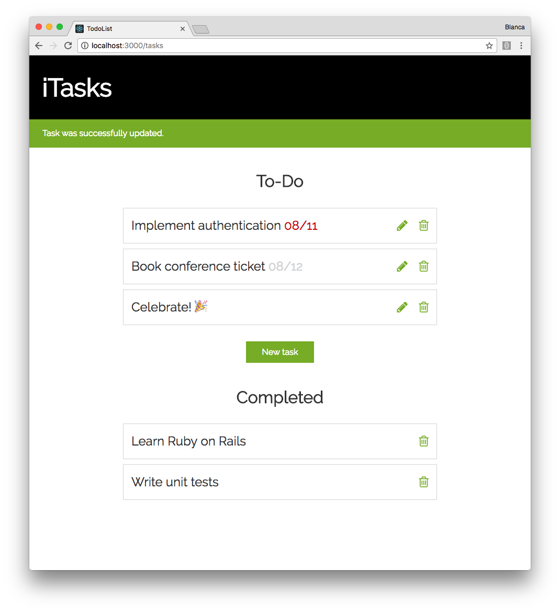
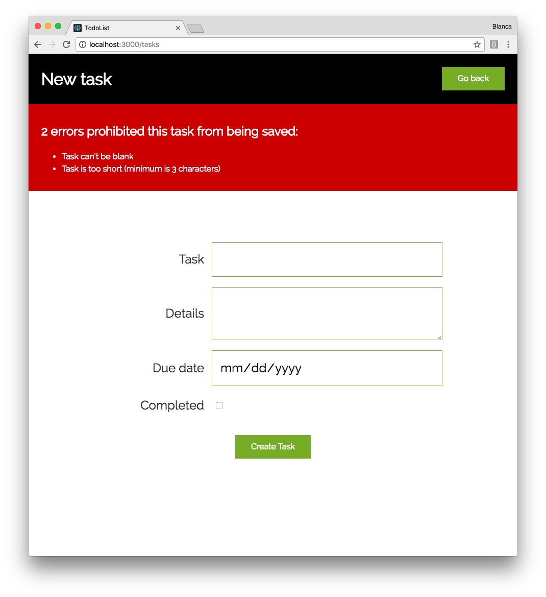
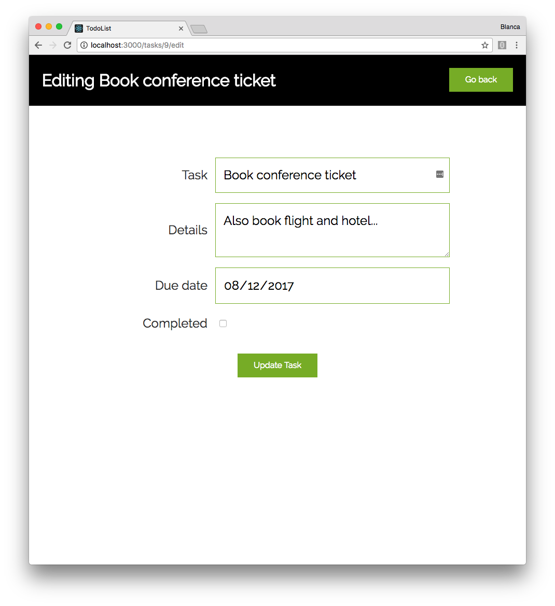
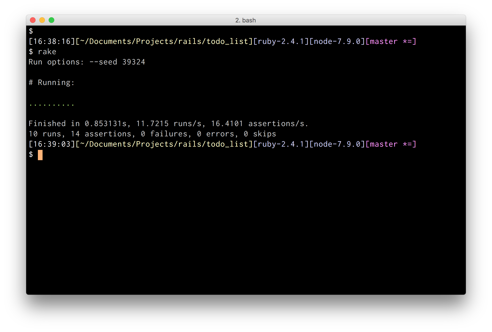

# To-Do List

Ruby on Rails application to manage tasks.

## Functionality

- As a user, I can add a task to the list.
- As a user, I can see all the tasks on the list in an overview.
- As a user, I can drill into a task to see more information about the task.
- As a user, I can delete a task.
- As a user, I can mark a task as completed.
- As a user, when I see all the tasks in the overview, if today's date is past the task's deadline, highlight it.





## Running the app

Clone this repo:

```
$ git clone https://github.com/groundberry/todo-list
```

Install all dependancies:

```
$ bundle install
```

Create the database and run migrations:

```
$ rake db:create db:migrate
```

Start the server:

```
$ rails server
```

And open the app in your browser at <http://localhost:3000/>.

## Testing the app

Run the tests:

```
$ rake
```



## Useful documentation

- [Ruby on Rails guides](http://guides.rubyonrails.org/)
